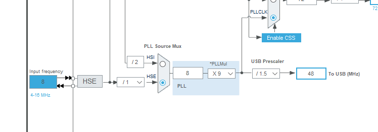

# RT-Thread package Userguide with usb stack

[中文版](rt-thread_zh.md)

To use usb stack package, you need to select it in the RT-Thread package manager. The specific path is as follows:

```
-> RT-Thread online packages
    -> system packages
        --- USB Stack: tiny and portable USB stack for embedded system with USB IP

            USB STACK Options  ---->
                    USB Speed (FS)  --->
                    [*] Enable usb device mode
                    [*]   Enable usb cdc acm device
                    [ ]   Enable usb hid device
                    [ ]   Enable usb dfu device
                    [ ]   Enable usb msc device
                    [ ]   Enable usb hub device
                    [ ]   Enable usb audio device
                    [ ]   Enable usb video device

            Version (latest)  --->
```

## How to use

### In STM32

Please note that stm32 series have two usb ip. For usb ip, like stm32f0、stm32f1、stm32f3, for usb otg ip(as we know it is from **synopsys**),like stm32f4、stm32f7 and so on.
~~Currently,if you usb usb device on mcu with usb ip, recommend you to use dcd porting named **usb_dc_nohal.c**,otherwise use **usb_dc_hal.c**.In the future,**usb_dc_hal.c** will be droped~~.

#### Use USB Device

- Firstly,you should have a bsp project,and then go to `board\CubeMX_Config` directory, open file that suffix name with `.ioc` in **STM32CubeMX**.
- Enable **USB** or **USB_OTG_FS** or **USB_OTG_HS** in **Connectivity** List,enable USB IRQ in **NVIC Setting**.


- Enable USB Clock for 48Mhz in **Clock configuration**.



- Generate code.
- Copy **SystemClock_Config** into **board.c**.
- ~~Copy **MX_USB_OTG_FS_PCD_Init** or **MX_USB_OTG_HS_PCD_Init** into **main.c** if you use **usb_dc_hal.c**.Also, USB Irq from **it.c** needs the same.~~
- Implement **usb_dc_low_level_init** and copy codes in from ``HAL_PCD_MspInit``.

```
void usb_dc_low_level_init(void)
{
    /* Peripheral clock enable */
    __HAL_RCC_USB_CLK_ENABLE();
    /* USB interrupt Init */
    HAL_NVIC_SetPriority(USB_LP_CAN1_RX0_IRQn, 0, 0);
    HAL_NVIC_EnableIRQ(USB_LP_CAN1_RX0_IRQn);

}
```

- Implement **printf** or modify with **rt_kprintf** in **usb_utils.h**, usb stack needs.
- Now we can call some functions provided by **usb_stack**.Your should register descriptors、interfaces and endpoint callback firstly, and then call `usb_dc_init`. Example is as follows:

```
int main(void)
{
    extern void cdc_init(void);
    cdc_init();
    usb_dc_init();
    while (1)
    {
        uint8_t data_buffer[10] = { 0x31, 0x32, 0x33, 0x34, 0x35, 0x31, 0x32, 0x33, 0x34, 0x35 };
        usbd_ep_write(0x81, data_buffer, 10, NULL);
        rt_thread_mdelay(500);
    }
}
```

- How to register class you can go to [stm32 class examples](https://github.com/sakumisu/usb_stack/tree/master/demo/stm32/stm32f103c8t6/example) for a reference.

#### CDC Demo Demonstration


#### Video manual

If you have problem from steps above, you can see this video：[Use USB Stack in RT-Thread package manager](https://www.bilibili.com/video/BV1Ef4y1t73d?p=26)。